# Emergent Multi-Agent Hide-and-Seek | Competitive RL

Reproducing OpenAI's [emergent hide-and-seek behaviors](https://openai.com/index/emergent-tool-use/) (Baker et al., ICLR 2020) in a 2D MuJoCo environment, training on a **single A10G GPU** with pure zero-sum competition — no shaped rewards, no demonstrations.

All behaviors below emerged from scratch through self-play.

---

## Testing Phase — Plain Arena

Before committing to the full architecture, I ran initial experiments in a plain open arena (no rooms, no boxes) to verify that basic chase/flee dynamics and line-of-sight awareness would emerge.

> **Blue = Hiders    Red = Seekers**

<table>
<tr>
<td align="center" width="50%">

**First cornering signs**

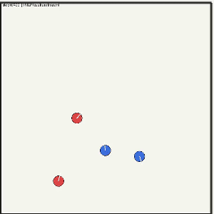

Hiders (blue) begin figuring out corner geometry — first sign that wall-based evasion is viable.

</td>
<td align="center" width="50%">

**Corner confusion**

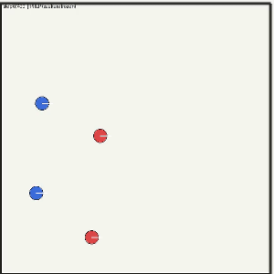

Hiders (blue) consistently get caught at corners — they reach the wall but cannot yet exploit geometry to break line-of-sight.

</td>
</tr>
<tr>
<td align="center" width="50%">

**FOV evasion**

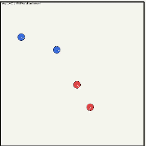

Watch the bottom hider (blue) and bottom seeker (red): the hider rolls *against* the seeker — stepping outside its 135-degree FOV without fleeing far.

</td>
<td align="center" width="50%">

**Risk vs reward**

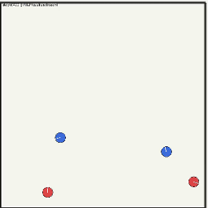

Hiders (blue) flee and cause seekers (red) to lose them from FOV. Seekers respond by going to corners to reclaim full arena vision — trading mobility for information.

</td>
</tr>
</table>

Basic dynamics confirmed. Switched to the full environment with rooms, boxes, and the MAPPO + GAE training setup.

---

## MAPPO + GAE

**Multi-Agent PPO** with Generalized Advantage Estimation — one shared actor (Transformer + LSTM) for all agents, a centralized global value network for advantage computation, and a zero-sum reward: +1/EPISODE_LEN per step for the team that's winning.

### Phase 0 — Chase / Flee (Checkpoints 4k–6k)

Seeking and fleeing emerge by **checkpoint 4k**. By 5k–6k, agents develop genuine cornering strategy: seekers use tight angles to cut off escape routes, hiders use corners to break line-of-sight.

<table>
<tr>
<td align="center">

**Chase/flee at 4k**

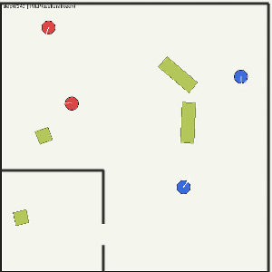

Clean pursuit and evasion — seekers converge on hiders, hiders break away using open space.

</td>
<td align="center">

**Perfect cornering at 5k–6k**

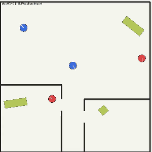

Seekers master corner cuts. Hiders learn to use wall geometry to break pursuit.

</td>
<td align="center">

**Coordination at 6k**

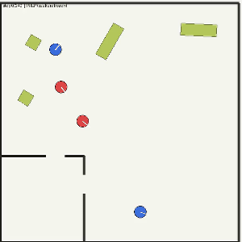

Early seeker coordination — two seekers begin splitting to cut off escape paths.

</td>
</tr>
</table>

> **OpenAI baseline**: 2.69M episodes for chasing to emerge. This project: ~160K episodes on a single GPU — ~10× fewer after accounting for the 2D–3D gap (phases 0–1 are dominated by planar navigation and horizontal line-of-sight, making the 2D discount small).

---

### Phase 0 → 1 — Early Box Interaction (Checkpoints 8k–10k)

Ran until ~8k–9k to check if hiders would discover room hiding. Room entry was inconsistent but appeared in several episodes. Notably, hiders began picking up boxes and dragging them to walls — repurposing their previous corner-hiding strategy with objects.

<table>
<tr>
<td align="center" width="50%">

**Early box usage at 8k–10k**

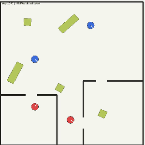

Hiders try to hide *behind* boxes by dragging them to walls, extending the corner-hiding instinct to objects.

</td>
<td width="50%"></td>
</tr>
</table>

---

### Phase 1 — Seekers Enter Rooms (Checkpoints 12k–15k, Quadrant Spawn)

Switched to **quadrant spawn mode** — hiders and boxes spawn inside the first room, seekers outside — to give the environment a natural pressure gradient for room-based strategies. By 12k–15k, seekers learn to enter rooms to find hiders.

<table>
<tr>
<td align="center">

**Seeker enters room — part 1 (12k)**

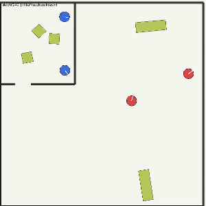

Seeker navigates through the doorway and begins searching inside the room.

</td>
<td align="center">

**Seeker enters room — part 2 (13k)**

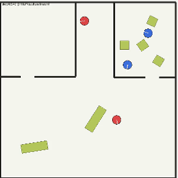

Seeker improves room entry, scanning more efficiently once inside.

</td>
<td align="center">

**Seeker enters room — part 3 (15k)**

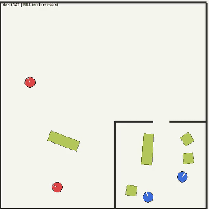

Consistent room entry. Seekers treat the doorway as a key strategic point.

</td>
</tr>
</table>

---

### Phase 1 — Hiders Use Rooms + Box Positioning (Checkpoints 20k–25k)

Hiders respond to seekers entering rooms by developing room-based hiding with box assistance. By 20k, single-box room hiding emerges. By 22k–25k, both hiders coordinate to use separate boxes for deeper concealment.

<table>
<tr>
<td align="center">

**Box used to hide in room at 20k**

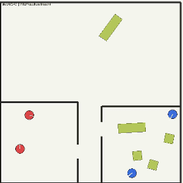

Hider drags a box to improve its concealment position inside the room.

</td>
<td align="center">

**Box positioning at 20k — view 2**

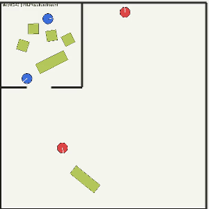

Another episode at the same checkpoint — hider positions the box closer to the doorway, beginning to understand the entrance as the key threat point.

</td>
</tr>
<tr>
<td align="center">

**Two-box coordination at 22k–25k**

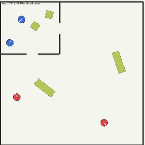

Both hiders each take a box and position them to maximize wall-cover inside the room.

</td>
</tr>
</table>

---

### Phase 2 — Doorway Blocking + Locking (Checkpoints 27k–30k)

The most sophisticated behavior: hiders learn that going near the doorway risks being seen. They deliberately avoid the doorway, position boxes *exactly* at the entrance, and **lock them in place** to prevent seekers from pushing them aside.

<table>
<tr>
<td align="center" width="50%">

**Doorway blocking + lock at 27k–30k**

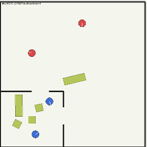

Hider won't leave the room even when near the door. Positions box at the exact doorway width and locks it — the equivalent of barricading the door.

</td>
<td width="50%"></td>
</tr>
</table>

---

## COMA — Mid-Run Failure

After observing these results, I switched to **COMA** (Counterfactual Multi-Agent) credit assignment mid-run to test whether per-agent counterfactual gradients would accelerate Phase 2 convergence. COMA collapsed both policies within ~40 iterations: the centralized Q-critic's counterfactual differences are dominated by noise at this reward horizon (SNR measured at 0.15, well below 1). Per-minibatch normalization amplifies this noise to unit-scale gradients, and entropy dropped to 0.05 — a degenerate fixed-action policy.

---

## Difference Rewards — Custom Credit Assignment

Instead of learning the counterfactual from a noisy Q-critic, I computed it **exactly** from the line-of-sight structure of the reward:

```
D_i = G − G_{-i}
```

Each agent's reward is the global team reward minus the reward the team would have received without agent *i*. This requires no learned approximation — the LOS raycasting already determines who is visible to whom, so removing agent *i* gives the exact counterfactual.

The advantage combines team-level signal with per-agent marginal credit:

```
A_i = normalize(GAE_team) + κ · normalize(discounted-sum D_i)
```

**Result**: chase/flee emerged again by checkpoint **5k–6k**, matching MAPPO+GAE — validating that the pipeline is stable under DR and that COMA's failure was an approximation noise problem, not a fundamental credit-assignment problem.

Code: [`difference_rewards/training/updater.py`](difference_rewards/training/updater.py)

> **Blue = Hiders &nbsp;&nbsp; Red = Seekers**

<table>
<tr>
<td align="center">

**DR chase/flee at 4.5k**

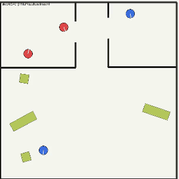

Chase/flee re-emerges by 4.5k under Difference Rewards. Note hiders (blue) continuously rotating — actively scanning with their 135-degree FOV to track seekers rather than fleeing blind.

</td>
<td align="center">

**DR chasing**

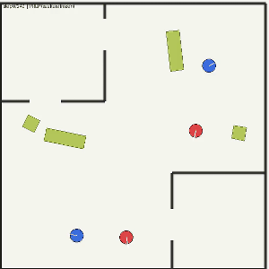

Seekers (red) maintain tight pursuit under DR. Behavior quality matches MAPPO+GAE at the same checkpoint range — confirming DR's stability.

</td>
</tr>
</table>

---

## Architecture

```
Observation (entity list: 12 × 18-dim + 72-ray LiDAR + 2 time scalars)
         │
Entity Embedding MLP (shared weights, per entity)
         │
Masked Residual Self-Attention (2 layers, 4 heads, 128-dim)
         │
Mean-pool over valid entities → 128-dim context
    │                                    │
  LSTM (256 hidden)              Dual-channel RND
    │                            (spatial + interaction,
  Actor heads (4 independent)    losing-team gated)
    ├─ Move:   9 actions
    ├─ Rotate: 3 actions
    ├─ Grab:   2 actions
    └─ Lock:   2 actions
         = 108 joint actions

Centralized Global Value Network
    Input: global state (109-dim)
    Output: separate hider / seeker / intrinsic values
```

**Environment**: MuJoCo 2D, 10m × 10m arena, procedural BSP rooms, 72-ray full-circle LiDAR, 135° FOV occlusion, grab and lock mechanics for boxes (4–6 per episode, ≥2 elongated), 40% preparation phase (seekers frozen), 60% competition.

---

## Comparison with OpenAI

| | This project | OpenAI (Baker et al.) |
|---|---|---|
| **Environment** | MuJoCo 2D (top-down) | MuJoCo 3D |
| **Agents** | 2 hiders + 2 seekers | 1–3 hiders + 1–3 seekers |
| **Algorithm** | MAPPO + Difference Rewards (per-agent credit) | PPO + shared team value baseline (no per-agent credit) |
| **Compute** | Single GPU (A10G), 32 envs | Multi-GPU cluster + 4000 CPUs |
| **Chase/flee emergence** | ~160K episodes *(consistent)* | 0–2.69M episodes |
| **Room hiding + object use** | ~640K–960K episodes *(emerging — seen in ~85–90% of episodes, not yet fully refined)* | 2.69–8.62M episodes |
| **Doorway blocking + lock** | ~864K–960K episodes *(emerging — seen in ~85–90% of episodes, not yet fully refined)* | 2.69–8.62M episodes |

> Phases 0–1 are dominated by planar navigation and horizontal line-of-sight — OpenAI's agents are also floor-bound in those phases, making the episode-count comparison meaningful. The efficiency gain for later phases is also partly attributable to the simpler 2D action and physics space.

---

## Project Structure

```
├── env/                          # MuJoCo 2D environment (shared)
│   ├── hide_and_seek.py          # Physics, LiDAR, FOV, grab/lock
│   ├── entities.py               # Agent and Box dataclasses
│   ├── rooms.py                  # Procedural BSP room generation
│   └── vec_env.py                # Vectorized parallel environments
│
├── models/                       # Neural network architecture (shared)
│   ├── sensory.py                # Transformer encoder + LiDAR embedder
│   ├── actor.py                  # MAPPO policy: LSTM + 4 action heads
│   ├── critics.py                # COMA critic + global value networks
│   └── rnd.py                    # Dual-channel RND module
│
├── mappo_gae/                    # MAPPO + GAE training (baseline)
│   ├── constants.py
│   ├── train.py
│   ├── modal_train.py
│   └── training/
│       ├── buffer.py
│       └── updater.py            # GAE advantage computation
│
├── difference_rewards/           # Difference Rewards training (final)
│   ├── constants.py
│   ├── train.py
│   ├── modal_train.py
│   └── training/
│       ├── buffer.py
│       └── updater.py            # DR advantage: D_i = G − G_{-i}
│
├── evaluate.py                   # Evaluation + video rendering
└── requirements.txt
```

---

## Usage

```bash
pip install -r requirements.txt

# Train with MAPPO + GAE
cd mappo_gae
python train.py --iterations 30000 --envs 32 --device cuda

# Train with Difference Rewards
cd difference_rewards
python train.py --iterations 10000 --envs 32 --device cuda

# Resume from checkpoint
python train.py --resume checkpoint_5000.pth

# Cloud training (Modal Labs)
modal run modal_train.py

# Generate evaluation video
python ../evaluate.py checkpoint_5000.pth output.mp4
```

---

## References

- Baker et al., ["Emergent Tool Use From Multi-Agent Autocurricula"](https://arxiv.org/abs/1909.07528), ICLR 2020
- Foerster et al., ["Counterfactual Multi-Agent Policy Gradients"](https://arxiv.org/abs/1705.08926), AAAI 2018
- Yu et al., ["The Surprising Effectiveness of PPO in Cooperative Multi-Agent Games"](https://arxiv.org/abs/2103.01955), NeurIPS 2022
